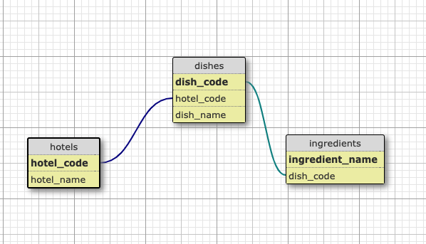

# Conception SID

Ce répertoire contient les datasets utilisés pendant le cours de Conception SID à l'ORT de Montreuil.

Pour chacun des datasets voici les questions auxquels je vous propose de répondre.

### dataset-1 & dataset-2

- Quelles sont les totaux des ventes journalières de chacun des 2 produits les plus vendus ?

### dataset-3

- Quels sont les 2 produits que les femmes achètent le plus le mercredi ?
- Combien dépensent en moyenne les hommes les samedi après midi?
- Comparez les produits qu'achètent les hommes et les femmes entre 17h et 21h ?
- Quels sont les 3 mois de l'année qui rapportent le plus de chiffres d'afffaire ?

Prix unitaires des produits

| sku    | unit-price |
| ------ | ---------- |
| 25CB99 | 31         |
| 87A4E4 | 38         |
| CC2B77 | 46         |
| AED206 | 39         |
| 9C88F3 | 25         |
| ECC5CE | 36         |
| 77AA3D | 44         |
| D8470A | 21         |
| 647EED | 40         |
| 4E3B4C | 28         |

### dataset-4

Vous êtes Business Analyst dans une entreprise qui fournit des ingrédients de repas dans les hotels dans le monde.

`dataset-4.csv` contient la liste de tous les contrats que vous avez déjà réalisés ainsi que les ingredients que vous avez déjà vendus.

Dès que vous avez déjà vendu un ingrédient à un hotel, vous disposez de la licence vous permettant de vendre ce même ingrédient à d'autres hotels.

`leads.db` est une base de données de potentiels hotels que vous pouvez contactez en vue de leur vendre des ingrédients que vous avez vendu à d'autres hotels.

Voici le schéma de la base de donnée:



#### Votre mission:

L'équipe Commercial a besoin de savoir quels sont les hotels à contacter pour leur vendre les ingrédients dont l'entreprise dispose une licence.

### dataset-5

You are Business Analyst for a tourism agency.

You have been given the dataset-5 in sql, json and xml.

#### Your mission

Help the CEO answers these questions:

#### 1. What are the transportation modes used per country ?

Expected outputs:

- a csv file per country.
  e.g transportation-modes-egypt.csv

```csv
transportation_mode, count
car, 12343
bicycle, 43434

```

- a graphic displaying the results
- the code used to generate the data

#### 2. How much people paid for hotel per country ?

Expected outputs:

- a csv file with the data. Give the data starting with the country with the most revenue.
  e.g countries-revenues.csv

```csv
country, hotel_revenue
Egypt, 43545
Bangladesh, 43324
```

- a graphic displaying the results
- the code used to generate the data

#### 3. What are the 10 hotels with the most revenues during the summer ? (By summer, consider that either the arrival and/or the departure are in July or August)

Expected outputs:

- a csv file with the data. Give the data starting with the hotel with the most revenue.
  e.g hotels-revenues.csv

```csv
hotel, revenue
Feil LLC, 999
Nienow LLC, 555
```

- a graphic displaying the results
- the code used to generate the data

#### 4. Compare the mode of transports used by men and women in each country.

Expected outputs:

- a csv file per country
  e.g transportation-modes-genre-egypt.csv

```csv
genre, transportation_mode,count
M,car,132
F,airplane,243
```

- a graphic displaying the results
- the code used to generate the data

### dataset-6

#### Football

Vous disposez des résultats du dernier championnat de Ligue 1.

Extrayez les données pour construire le classement de fin de saison.

Pour chaque équipe, il faudra renseigner les éléments suivants:

- Pts: Nombre de points gagnés depuis le début du championnat
- G. : Nombre de matchs gagnés
- N. : Nombre de matchs nuls
- P. : Nombre de matchs perdus
- p. : Nombre de buts gagnés depuis le début du championnat
- c. : Nombre de buts encaissés depuis le début du championnat
- Diff: Différence entre le nombre de buts gagnés et encaissés

Fichier csv attendus:

```csv
rank,team,Pts,G.,N.,P.,p.,c.,Diff.
1,Paris Saint-Germain,38,10,2,2,10,2,+8
2,Lille,36,9,3,1,9,3,+5
```

#### Developer KPIs

Given the dataset `dataset-6/kpis/dataset-6-tickets-kpis.csv`, you have to build csv files that contains the following KPIs:

##### 1. Dev capacity: the number of developers days in the team per quarter

Developper days is computed by multiplying the number of the developer by the number of days in the quarter.

```csv
quarter, dev_capacity
q1, 210
q2, 220
q3, 230
q4, 240
```

##### 2. Total number of tickets done per quarter

```csv
quarter, total_tickets
q1, 100
q2, 200
q3, 300
q4, 400
```

##### 3. Average number of tickets done per developer per week

```csv
quarter, average_tickets
q1, 3
q2, 5
q3, 3
q4, 6
```

##### 4. Median cycle time of tickets per quarter

How many days does it take to close a ticket (a ticket to go from in progress to done) ?

```csv
quarter, median_cycle_time
q1, 10
q2, 20
q3, 30
q4, 40
```

##### 5. Median cycle time of tickets per quarter, by type

```csv
quarter, type, median_cycle_time
q1, bug, 10
q1, task, 20
q1, story, 30
q2, bug, 30
q2, task, 40
q2, story, 50
q3, bug, 50
q3, task, 60
q3, story, 70
q4, bug, 70
q4, task, 80
q4, story, 90
```

##### 6. Time Allocation (in percentage) by Ticket Type per quarter

```csv
quarter, type, time_allocation
q1, bug, 10
q1, task, 20
q1, story, 30
q2, bug, 30
q2, task, 40
q2, story, 50
q3, bug, 50
q3, task, 60
q3, story, 70
q4, bug, 70
q4, task, 80
q4, story, 90
```
